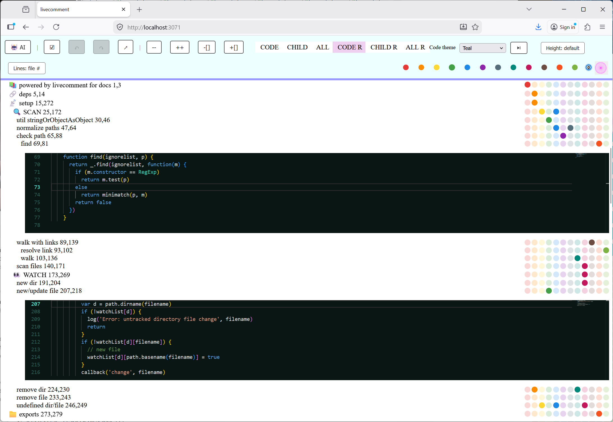

### LiveComment — web framework for Node and your AI code

A small **web framework** around your repo: Express serves the UI, Socket.IO keeps the tree in sync, and **plugins** extend the browser with the same `//:=frame('client.exec')` story on client and server. Your **code** stays center stage. Built for fast navigation, live reload, and **AI-assisted** work (one surface for you, your editor, and tools).

#### Features

* Minimal core, strong **plugin** story with live reload (`plugins/0/…`)
* **Same code** for client and server where you want it — e.g. `//:=frame('client.exec')`
* **Auto ports**: if HTTP or WebSocket ports are taken, the next free ones are used (see console)
* Optional **VSCode/monaco** for code blocks (themes, line modes, fit height) — plugin `D000-monaco-editor.js`
* **Drag–drop** scopes and nodes, safer path paste — `C000-drag-drop-content.js`
* **Color tags** on nodes, persisted locally, filter/hide by color — `F000-color-buttons.js`
* Multilanguage highlighting, file watch, code navigator

#### Screens



#### Vibe

* For 80/20 developers who live in the tree
* Code navigator, refactor-friendly structure
* Local “cloud IDE” extension: browser + your disk
* Brain helper for big codebases — and for models that need **grounded** file context

#### Install

```
$ npm install -g livecomment
```

#### Run demo

Livecomment current directory
Scan for files contains livecomment blocks `# PYTHON-BLOCK [` or `// C-BLOCK [`  
```
$ livecomment
```

#### Open URL

[http://localhost:3070/](http://localhost:3070/)

#### Usage sample

```javascript

// Import LiveComment module

var LiveComment = require('livecomment');

// Define options (defaults: livecomment/config/config.js)

var options = {
  port: 3070,
  ws_port: 3071,
  dangerousCodeExecution: ['client', 'server'], // for plugins
  debug: 1,
  common: {
    ignore: [
      /^node_modules.*/,
      /^\.idea.*/,
      /^\.svn.*/,
      /^\.git.*/
    ]
  },
  paths: [
    '/path/to/dir/',
    // === or ===
    {
      '/path/to/dir1': {
        ignore: [
          /.*dist.*/
        ]
      }
    }
  ]
};

// Start server

var livecomment = new LiveComment(options);

```

#### Console output sample

If a configured port is already in use, you will see a line like `HTTP port 3070 in use, using 3071` (and similarly for the WebSocket port). Default case:

```
=== LiveComment Configuration ===
Server Settings:
  ...
==============================

EXE.ONFRAME [server.exec][][frame] function
Scan files [
/path/to/dir/livecomment [
/path/to/dir/livecomment ]
Scan files ]
Watch for changes [
 /path/to/dir/livecomment
 /path/to/dir/livecomment/bin
 /path/to/dir/livecomment/config
 /path/to/dir/livecomment/plugins
 /path/to/dir/livecomment/public/css
 /path/to/dir/livecomment/public/js
 /path/to/dir/livecomment/views
Watch for changes ]
✔ socket.io server listening on port 3071
✔ Express server listening on port 3070 in development mode
/path/to/dir/livecomment/bin/index-debug.js javascript
EXE.EMIT [this][CHECK FORMAT][mount] undefined CHECK FORMAT
EXE.EMIT [this][SUPPORT FORMATS][mount] undefined SUPPORT FORMATS
/path/to/dir/livecomment/config/config.js javascript
EXE.EMIT [this][DEFAULT CONFIG][mount] undefined DEFAULT CONFIG
/path/to/dir/livecomment/livecomment.js javascript
...
```

(Order of the two `✔` lines can vary slightly. If ports clash, the printed numbers match the chosen ports.)

#### Archive

Archive [README-old.md](README-old.md).

#### Donate BTC

18Bth1u3pSJzPrCf21tx1F6iSzA2fgKdfU

#### License

[MIT](https://github.com/d08ble/livecomment/blob/master/LICENSE)
