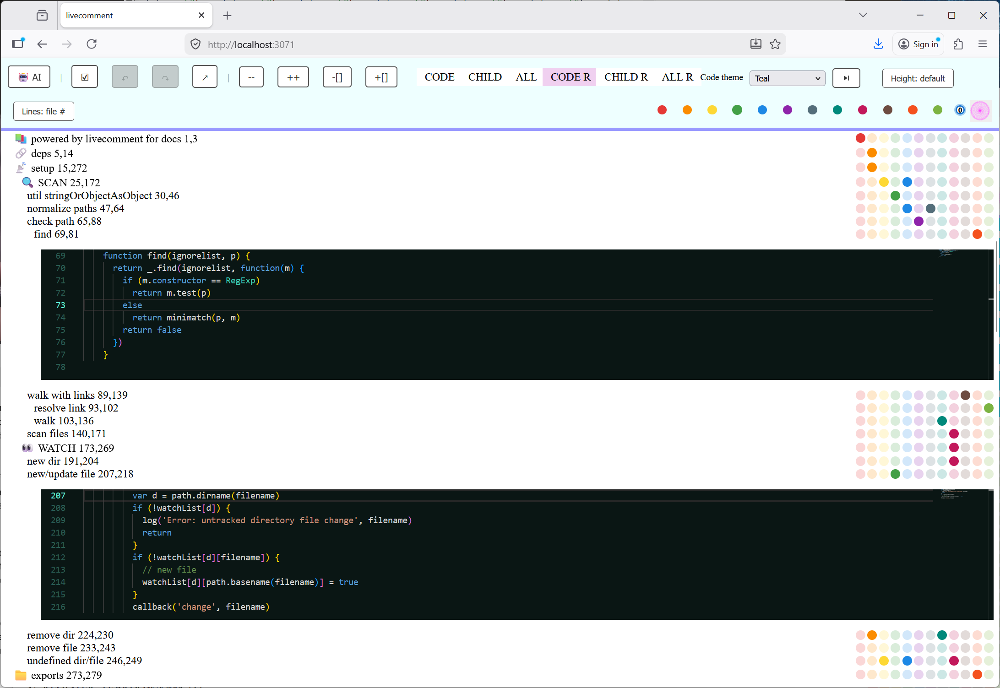
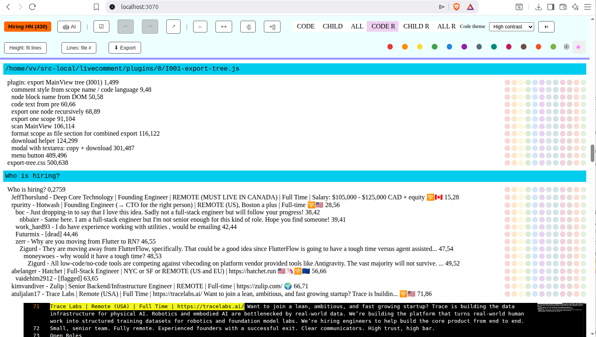

### LiveComment — web framework for Node and your AI code

A small **web framework** around your repo: Express serves the UI, Socket.IO keeps the tree in sync, and **plugins** extend the browser with the same `//:=frame('client.exec')` story on client and server. Your **code** stays center stage. Built for fast navigation, live reload, and **AI-assisted** work (one surface for you, your editor, and tools).

#### Features

* Minimal core, strong **plugin** story with live reload (`plugins/0/…`)
* **Same code** for client and server where you want it — e.g. `//:=frame('client.exec')`
* **Auto ports**: if HTTP or WebSocket ports are taken, the next free ones are used (see console)
* Optional **VSCode/monaco** for code blocks (themes, line modes, fit height) — plugin `D000-monaco-editor.js`
* **Drag–drop** scopes and nodes, safer path paste — `C000-drag-drop-content.js`
* **Color tags** on nodes, persisted locally, filter/hide by color — `F000-color-buttons.js`
* Multilanguage highlighting, file watch, code navigator

#### Screens



#### Vibe

* For 80/20 developers who live in the tree
* Code navigator, refactor-friendly structure
* Local “cloud IDE” extension: browser + your disk
* Brain helper for big codebases — and for models that need **grounded** file context

#### Plugins

Extensions in `plugins/0/` (live reload). Index:

* [0000 Init](#0000-init)
* [A000 Route](#a000-route)
* [B000 URL iframe preview](#b000-url-iframe-preview)
* [C000 Drag-drop content](#c000-drag-drop-content)
* [D000 Monaco editor](#d000-monaco-editor)
* [E000 Enable-disable](#e000-enable-disable)
* [F000 Color buttons](#f000-color-buttons)
* [G000 Ruler](#g000-ruler)
* [I000 AI](#i000-ai)
* [I001 Export tree](#i001-export-tree)
* [J001 HN Firebase — Who is hiring](#j001-hn-firebase)

## 0000 Init

`0000-init.js` — Client and server bootstrap (`client.exec` / `server.exec`); registers `client.css` frame for scoped `<style>` tags; default menu and scope styling.

## A000 Route

`A000-route.js` — Server routes `/b`, `/c`, `/plugins`; `filterRoute` rewrites `*HIDE*` nodes and `*TEST_HOSTNAME*` placeholders; `?queryHash=plugins_only` limits the tree to `plugins/0/`.

## B000 URL iframe preview

`B000-url-iframe-preview.js` — **Preview** button on highlighted links in code blocks; toggles an inline iframe (sites with `X-Frame-Options` may not embed).

## C000 Drag-drop content

`C000-drag-drop-content.js` — Drag scope names and node names from the tree; drop into editors or paste paths (basenames for local files, full URL for `http(s)`).

## D000 Monaco editor

`D000-monaco-editor.js` — Monaco / VS Code editor for code blocks (CDN); language mapping, themes, line-number modes, fit-to-content height.

## E000 Enable-disable

`E000-enable-disable.js` — Toggle nodes on/off in the tree (persisted in `localStorage`); undo/redo; export enabled or disabled outline from the menu.

## F000 Color buttons

`F000-color-buttons.js` — Twelve color tags per node (stored locally); filter or hide by color; reading-line scroll offset below the menu.

## G000 Ruler

`G000-ruler.js` — Log-scale ruler widgets on nodes via `//:=frame('ruler')` JSON config; markers, cursor, pan/zoom; visibility persisted per ruler.

## I000 AI

`I000-ai.js` — **AI** menu button (placeholder for future AI actions).

## I001 Export tree

`I001-export-tree.js` — **Export** menu button: MainView tree → livecomment block syntax per scope; preview, copy, single or multi-file download, optional ZIP.

## J001 HN Firebase — Hacker News Who is hiring plugin

`J001-hn-firebase.js` — Loads the monthly **Ask HN: Who is hiring?** thread ([item 48357725](https://news.ycombinator.com/item?id=48357725)) through the [HN Firebase API](https://github.com/HackerNews/API), builds a nested LiveComment tree (comments → nodes, jobs → segment text), and decorates job lines with location hints (country flags, remote / on-site). **Hiring HN** menu button shows fetch progress while the thread loads.



#### Install

```
$ npm install -g livecomment
```

#### Run demo

Livecomment current directory
Scan for files contains livecomment blocks `# PYTHON-BLOCK [` or `// C-BLOCK [`  
```
$ livecomment
```

#### Open URL

[http://localhost:3070/](http://localhost:3070/)

#### Usage sample

```javascript

// Import LiveComment module

var LiveComment = require('livecomment');

// Define options (defaults: livecomment/config/config.js)

var options = {
  port: 3070,
  ws_port: 3071,
  dangerousCodeExecution: ['client', 'server'], // for plugins
  debug: 1,
  common: {
    ignore: [
      /^node_modules.*/,
      /^\.idea.*/,
      /^\.svn.*/,
      /^\.git.*/
    ]
  },
  paths: [
    '/path/to/dir/',
    // === or ===
    {
      '/path/to/dir1': {
        ignore: [
          /.*dist.*/
        ]
      }
    }
  ]
};

// Start server

var livecomment = new LiveComment(options);

```

#### Console output sample

If a configured port is already in use, you will see a line like `HTTP port 3070 in use, using 3071` (and similarly for the WebSocket port). Default case:

```
=== LiveComment Configuration ===
Server Settings:
  ...
==============================

EXE.ONFRAME [server.exec][][frame] function
Scan files [
/path/to/dir/livecomment [
/path/to/dir/livecomment ]
Scan files ]
Watch for changes [
 /path/to/dir/livecomment
 /path/to/dir/livecomment/bin
 /path/to/dir/livecomment/config
 /path/to/dir/livecomment/plugins
 /path/to/dir/livecomment/public/css
 /path/to/dir/livecomment/public/js
 /path/to/dir/livecomment/views
Watch for changes ]
✔ socket.io server listening on port 3071
✔ Express server listening on port 3070 in development mode
/path/to/dir/livecomment/bin/index-debug.js javascript
EXE.EMIT [this][CHECK FORMAT][mount] undefined CHECK FORMAT
EXE.EMIT [this][SUPPORT FORMATS][mount] undefined SUPPORT FORMATS
/path/to/dir/livecomment/config/config.js javascript
EXE.EMIT [this][DEFAULT CONFIG][mount] undefined DEFAULT CONFIG
/path/to/dir/livecomment/livecomment.js javascript
...
```

(Order of the two `✔` lines can vary slightly. If ports clash, the printed numbers match the chosen ports.)

#### Archive

Archive [README-old.md](README-old.md).

#### Donate

BTC 💰
18Bth1u3pSJzPrCf21tx1F6iSzA2fgKdfU

SOL Solana 💰
9gLVQr97baX3KrG9DyaUDd5FwXaiLcDuU6CK5RCNMnWu

ETH Ethereum 💰
0x072c709a8Ad95Fc182e0E2EEF834C3d944122f0b

USDT Ethereum 💰
0x072c709a8Ad95Fc182e0E2EEF834C3d944122f0b

DOGE Dogecoin 💰
DJP8425i4sGT4tSEXwEDRPJb4vJBGroJs6

LTC Litecoin 💰
ltc1q69gg9udgqnky60n7mfzfaj0w7lu80ujx6fysly

TRX Tron 💰
TLjkoQfnu7aRRbVRkEYN1vZPzW7ntuM4tn


#### License

[MIT](https://github.com/d08ble/livecomment/blob/master/LICENSE)
